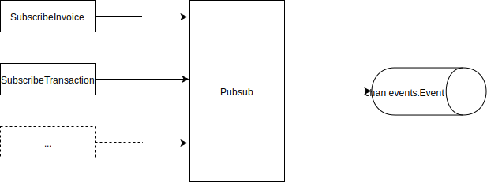

+++
title = "Meetup Go 2019-06-18"
outputs = ["Reveal"]
[reveal_hugo]
highlight_theme = "vs"
custom_theme = "css/slides.css"
+++

#  Connect yourself to the lightning network with Go

An example with LND and lntop

<small>Edouard Paris - https://edouard.paris/slides/2019-06-18-meetup-go-paris</small>

---

{}

## Bitcoin

* 1976 Asymetric encryption - Diffie-Hellman
* 1992 ECDSA - Scott Vanstone
* 1992 Cypherpunk: E. Hughes - T. May - J. Gilmore
* 1997 Hashcash - A. Black
* 1998 b-money - Wei Dai  | BitGold - N. Szabo
* 2008 Bitcoin whitepaper - S. Nakamoto
* 2009 first block mined


{}secp256k1: y² = x³ + 7{}

---


---


---



---

# 7 tx / s


{}

---

{}

## Lightning Network

* 2013 Payment channels - Nakamoto & Core devs
* 2015 Feb *Lightning Network* - J.Poon - T.Dryja
* 2015 Nov *Reaching the ground with LN* - R. Russell
* 2017 Dec Specs V1.0 Rc | first tx on mainnet
* 2028 Avr Majors implementations are on mainnet

---


---

# HTLC

*Hash Time Locked Contract*

* "I will give you X if you give me the preimage of H"
* H = **Payment Hash**, R = **Payment Preimage**
* **Time Locked**: If you don't give me R, I can get my money back after
    delay

Payment = **Amount** + **Payment Hash** + **Delay**

---


{}

---

{}
## The Lightning Daemon LND

- src: https://github.com/LightningNetwork/lnd
- doc: https://api.lightning.community/
- version: v0.7.0
- support: https://lightningcommunity.slack.com/

---




---

## Macaroons

*Macaroons: Cookies with Contextual Caveats for Decentralized Authorization in the Cloud"* (http://theory.stanford.edu/~ataly/Papers/macaroons.pdf)

code: https://gopkg.in/macaroon.v1

* `admin.macaroon`
* `readonly.macaroon`
* `invoice.macaroon`

---

```go
package client

import (
	"io/ioutil"
	"net/url"

	"github.com/pkg/errors"
	"google.golang.org/grpc"
	"google.golang.org/grpc/credentials"
	macaroon "gopkg.in/macaroon.v2"

	"github.com/lightningnetwork/lnd/lncfg"
	"github.com/lightningnetwork/lnd/macaroons"
)

type Config struct {
	Address         string `toml:"address"`
	Cert            string `toml:"cert"`
	Macaroon        string `toml:"macaroon"`
	MacaroonTimeOut int64  `toml:"macaroon_timeout"`
	MacaroonIP      string `toml:"macaroon_ip"`
	MaxMsgRecvSize  int    `toml:"max_msg_recv_size"`
	ConnTimeout     int    `toml:"conn_timeout"`
}

func NewConn(c *Config) (*grpc.ClientConn, error) {
	macaroonBytes, err := ioutil.ReadFile(c.Macaroon)
	if err != nil {
		return nil, err
	}

	mac := &macaroon.Macaroon{}
	err = mac.UnmarshalBinary(macaroonBytes)
	if err != nil {
		return nil, errors.WithStack(err)
	}

	constrainedMac, err := macaroons.AddConstraints(mac,
		macaroons.TimeoutConstraint(c.MacaroonTimeOut),
		macaroons.IPLockConstraint(c.MacaroonIP),
    )
	if err != nil {
		return nil, errors.WithStack(err)
	}

	cred, err := credentials.NewClientTLSFromFile(c.Cert, "")
	if err != nil {
		return nil, err
	}

	u, err := url.Parse(c.Address)
	if err != nil {
		return nil, err
	}

	conn, err := grpc.Dial(u.Hostname(),
		grpc.WithTransportCredentials(cred),
		grpc.WithPerRPCCredentials(macaroons.NewMacaroonCredential(constrainedMac)),
		grpc.WithDialer(lncfg.ClientAddressDialer(u.Port())),
		grpc.WithDefaultCallOptions(grpc.MaxCallRecvMsgSize(c.MaxMsgRecvSize)),
    )
	if err != nil {
		return nil, errors.WithStack(err)
	}

	return conn, nil
}
```

{}

---

## LNTOP

https://github.com/edouardparis/lntop


---


---

{}

### grpc connexion pool
https://github.com/processout/grpc-go-pool


---

```go
type Factory func() (*grpc.ClientConn, error)

type Pool struct {
	conns   chan Conn
	factory Factory
	mu      sync.RWMutex
	timeout time.Duration
}

func (p *Pool) Get(ctx context.Context) (*Conn, error) {
    p.mu.Lock()
	conns := p.conns
	p.mu.Unlock()

	if conns == nil {
		return nil, ErrClosed
	}

	conn := Conn{
		pool: p,
	}

	select {
	case conn = <-conns:
	case <-ctx.Done():
		return nil, ErrTimeout
	}

	if conn.ClientConn != nil &&
		p.timeout > 0 &&
		conn.usedAt.Add(p.timeout).Before(time.Now()) {
		conn.ClientConn.Close()
		conn.ClientConn = nil
	}

	var err error
	if conn.ClientConn == nil {
		conn.ClientConn, err = p.factory()
		if err != nil {
			conns <- Conn{
				pool: p,
			}
		}
	}

	return &conn, err
}

func (p *Pool) Close() {
	p.mu.Lock()
	conns := p.conns
	p.conns = nil
	p.mu.Unlock()

	if conns == nil {
		return
	}

	close(conns)
	for i := 0; i < p.Capacity(); i++ {
		client := <-conns
		if client.ClientConn == nil {
			continue
		}
		client.ClientConn.Close()
	}
}
```

---


```go

package pool

import (
	"time"

	"google.golang.org/grpc"
)

type Conn struct {
	*grpc.ClientConn
	pool   *Pool
	usedAt time.Time
}

func (c *Conn) Close() error {
	if c == nil {
		return nil
	}
	if c.ClientConn == nil {
		return ErrAlreadyClosed
	}
	if c.pool.IsClosed() {
		return ErrClosed
	}

	conn := Conn{
		pool:       c.pool,
		ClientConn: c.ClientConn,
	}
	select {
	case c.pool.conns <- conn:
	default:
		return ErrFullPool
	}
	return nil
}
```
{}

---


{}
### pubsub


---

```go

package pubsub

import (
	"context"
	"sync"

	"github.com/edouardparis/lntop/events"
	"github.com/edouardparis/lntop/logging"
	"github.com/edouardparis/lntop/network"
	"github.com/edouardparis/lntop/network/models"
)

type PubSub struct {
	stop    chan bool
	logger  logging.Logger
	network *network.Network
	wg      *sync.WaitGroup
}

func New(logger logging.Logger, network *network.Network) *PubSub {
	return &PubSub{
		logger:  logger.With(logging.String("logger", "pubsub")),
		network: network,
		wg:      &sync.WaitGroup{},
		stop:    make(chan bool),
	}
}

```

---

```go

func (p *PubSub) invoices(ctx context.Context, sub chan *events.Event) {
	p.wg.Add(3)
	invoices := make(chan *models.Invoice)
	ctx, cancel := context.WithCancel(ctx)

	go func() {
		for invoice := range invoices {
			p.logger.Debug("received invoice", logging.Object("invoice", invoice))
			if invoice.Settled {
				sub <- events.New(events.InvoiceSettled)
			} else {
				sub <- events.New(events.InvoiceCreated)
			}
		}
		p.wg.Done()
	}()

	go func() {
		err := p.network.SubscribeInvoice(ctx, invoices)
		if err != nil {
			p.logger.Error("SubscribeInvoice returned an error", logging.Error(err))
		}
		p.wg.Done()
	}()

	go func() {
		<-p.stop
		cancel()
		close(invoices)
		p.wg.Done()
	}()
}

```

---
```go

func (l Backend) SubscribeInvoice(ctx context.Context, channelInvoice chan *models.Invoice) error {
	clt, err := l.Client(ctx)
	if err != nil {
		return err
	}
	defer clt.Close()

	cltInvoices, err := clt.SubscribeInvoices(ctx, &lnrpc.InvoiceSubscription{})
	if err != nil {
		return err
	}

	for {
		select {
		case <-ctx.Done():
			break
		default:
			invoice, err := cltInvoices.Recv()
			if err != nil {
				st, ok := status.FromError(err)
				if ok && st.Code() == codes.Canceled {
					l.logger.Debug("stopping subscribe invoice: context canceled")
					return nil
				}
				return err
			}

			channelInvoice <- lookupInvoiceProtoToInvoice(invoice)
		}
	}
}
```

{}

---

{}
# gocui

https://github.com/jroimartin/gocui

---

```go
package main

import (
	"fmt"
	"log"

	"github.com/jroimartin/gocui"
)

func main() {
	g, err := gocui.NewGui(gocui.OutputNormal)
	if err != nil {
		log.Panicln(err)
	}
	defer g.Close()

	g.SetManagerFunc(layout)

	if err := g.SetKeybinding("", gocui.KeyCtrlC, gocui.ModNone, quit); err != nil {
		log.Panicln(err)
	}

	if err := g.MainLoop(); err != nil && err != gocui.ErrQuit {
		log.Panicln(err)
	}
}

func layout(g *gocui.Gui) error {
	maxX, maxY := g.Size()
	if v, err := g.SetView("hello", maxX/2-7, maxY/2, maxX/2+7, maxY/2+2); err != nil {
		if err != gocui.ErrUnknownView {
			return err
		}
		fmt.Fprintln(v, "Hello world!")
	}
	return nil
}

func quit(g *gocui.Gui, v *gocui.View) error {
	return gocui.ErrQuit
}
```

{}

---


{}

### Ui - MVC


---
```go
type controller struct {
	logger logging.Logger
	models *models.Models
	views  *views.Views
}
```


---

```go

func (c *controller) Listen(ctx context.Context, g *gocui.Gui,
    sub chan *events.Event) {

	c.logger.Debug("Listening...")
	refresh := func(fn ...func(context.Context) error) {
		for i := range fn {
			err := fn[i](ctx)
			if err != nil {
				c.logger.Error("failed", logging.Error(err))
			}
		}
		g.Update(func(*gocui.Gui) error { return nil })
	}

	for event := range sub {
		c.logger.Debug("event received",
            logging.String("type", event.Type))
		switch event.Type {
		case events.TransactionCreated:
			refresh(
				c.models.RefreshInfo,
				c.models.RefreshWalletBalance,
				c.models.RefreshTransactions,
			)
		case events.BlockReceived:
			refresh(
				c.models.RefreshInfo,
				c.models.RefreshTransactions,

    ...
```
---

```go
package models

import (
	"context"
	"sort"
	"sync"

	"github.com/edouardparis/lntop/network/models"
)

type TransactionsSort func(*models.Transaction, *models.Transaction) bool

type Transactions struct {
	current *models.Transaction
	list    []*models.Transaction
	sort    TransactionsSort
	mu      sync.RWMutex
}

func (t *Transactions) Current() *models.Transaction {
	return t.current
}

func (t *Transactions) SetCurrent(index int) {
	t.current = t.Get(index)
}

func (t *Transactions) List() []*models.Transaction {
	return t.list
}

func (t *Transactions) Len() int {
	return len(t.list)
}

func (t *Transactions) Swap(i, j int) {
	t.list[i], t.list[j] = t.list[j], t.list[i]
}

func (t *Transactions) Less(i, j int) bool {
	return t.sort(t.list[i], t.list[j])
}

func (t *Transactions) Sort(s TransactionsSort) {
	if s == nil {
		return
	}
	t.sort = s
	sort.Sort(t)
}

func (t *Transactions) Get(index int) *models.Transaction {
	if index < 0 || index > len(t.list)-1 {
		return nil
	}

	return t.list[index]
}

func (t *Transactions) Contains(tx *models.Transaction) bool {
	if tx == nil {
		return false
	}
	for i := range t.list {
		if t.list[i].TxHash == tx.TxHash {
			return true
		}
	}
	return false
}

func (t *Transactions) Add(tx *models.Transaction) {
	t.mu.Lock()
	defer t.mu.Unlock()
	if t.Contains(tx) {
		return
	}
	t.list = append(t.list, tx)
	if t.sort != nil {
		sort.Sort(t)
	}
}

func (t *Transactions) Update(tx *models.Transaction) {
	if tx == nil {
		return
	}
	if !t.Contains(tx) {
		t.Add(tx)
		return
	}

	t.mu.Lock()
	defer t.mu.Unlock()

	for i := range t.list {
		if t.list[i].TxHash == tx.TxHash {
			t.list[i].NumConfirmations = tx.NumConfirmations
			t.list[i].BlockHeight = tx.BlockHeight
		}
	}

	if t.sort != nil {
		sort.Sort(t)
	}
}

func (m *Models) RefreshTransactions(ctx context.Context) error {
	transactions, err := m.network.GetTransactions(ctx)
	if err != nil {
		return err
	}

	for i := range transactions {
		m.Transactions.Update(transactions[i])
	}

	return nil
}
```

---

```go

package views

import (
	"fmt"

	"github.com/jroimartin/gocui"
	"golang.org/x/text/language"
	"golang.org/x/text/message"

	"github.com/edouardparis/lntop/ui/color"
	"github.com/edouardparis/lntop/ui/models"
)

const (
	TRANSACTION        = "transaction"
	TRANSACTION_HEADER = "transaction_header"
	TRANSACTION_FOOTER = "transaction_footer"
)

type Transaction struct {
	view         *gocui.View
	transactions *models.Transactions
}

func (c Transaction) Name() string {
	return TRANSACTION
}

func (c Transaction) Empty() bool {
	return c.transactions == nil
}

func (c *Transaction) Wrap(v *gocui.View) View {
	c.view = v
	return c
}

func (c Transaction) Origin() (int, int) {
	return c.view.Origin()
}

func (c Transaction) Cursor() (int, int) {
	return c.view.Cursor()
}

func (c Transaction) Speed() (int, int, int, int) {
	return 1, 1, 1, 1
}

func (c *Transaction) SetCursor(x, y int) error {
	return c.view.SetCursor(x, y)
}

func (c *Transaction) SetOrigin(x, y int) error {
	return c.view.SetOrigin(x, y)
}

func (c *Transaction) Set(g *gocui.Gui, x0, y0, x1, y1 int) error {
	header, err := g.SetView(TRANSACTION_HEADER, x0-1, y0, x1+2, y0+2)
	if err != nil {
		if err != gocui.ErrUnknownView {
			return err
		}
	}
	header.Frame = false
	header.BgColor = gocui.ColorGreen
	header.FgColor = gocui.ColorBlack | gocui.AttrBold
	header.Clear()
	fmt.Fprintln(header, "Transaction")

	v, err := g.SetView(TRANSACTION, x0-1, y0+1, x1+2, y1-1)
	if err != nil {
		if err != gocui.ErrUnknownView {
			return err
		}
	}
	v.Frame = false
	c.view = v
	c.display()

	footer, err := g.SetView(TRANSACTION_FOOTER, x0-1, y1-2, x1, y1)
	if err != nil {
		if err != gocui.ErrUnknownView {
			return err
		}
	}
	footer.Frame = false
	footer.BgColor = gocui.ColorCyan
	footer.FgColor = gocui.ColorBlack
	footer.Clear()
	blackBg := color.Black(color.Background)
	fmt.Fprintln(footer, fmt.Sprintf("%s%s %s%s %s%s %s%s",
		blackBg("F1"), "Help",
		blackBg("F2"), "Menu",
		blackBg("Enter"), "Transactions",
		blackBg("F10"), "Quit",
	))
	return nil
}

func (c Transaction) Delete(g *gocui.Gui) error {
	err := g.DeleteView(TRANSACTION_HEADER)
	if err != nil {
		return err
	}

	err = g.DeleteView(TRANSACTION)
	if err != nil {
		return err
	}

	return g.DeleteView(TRANSACTION_FOOTER)
}

func (c *Transaction) display() {
	p := message.NewPrinter(language.English)
	v := c.view
	v.Clear()
	transaction := c.transactions.Current()
	green := color.Green()
	cyan := color.Cyan()
	fmt.Fprintln(v, green(" [ Transaction ]"))
	fmt.Fprintln(v, fmt.Sprintf("%s %s",
		cyan("           Date:"), transaction.Date.Format("15:04:05 Jan _2")))
	fmt.Fprintln(v, p.Sprintf("%s %d",
		cyan("         Amount:"), transaction.Amount))
	fmt.Fprintln(v, p.Sprintf("%s %d",
		cyan("            Fee:"), transaction.TotalFees))
	fmt.Fprintln(v, p.Sprintf("%s %d",
		cyan("    BlockHeight:"), transaction.BlockHeight))
	fmt.Fprintln(v, p.Sprintf("%s %d",
		cyan("NumConfirmations:"), transaction.NumConfirmations))
	fmt.Fprintln(v, p.Sprintf("%s %s",
		cyan("       BlockHash:"), transaction.BlockHash))
	fmt.Fprintln(v, fmt.Sprintf("%s %s",
		cyan("         TxHash:"), transaction.TxHash))
	fmt.Fprintln(v, "")
	fmt.Fprintln(v, green("[ addresses ]"))
	for i := range transaction.DestAddresses {
		fmt.Fprintln(v, fmt.Sprintf("%s %s",
			cyan("               -"), transaction.DestAddresses[i]))
	}

}

func NewTransaction(transactions *models.Transactions) *Transaction {
	return &Transaction{transactions: transactions}
}

```

---

{}

---


